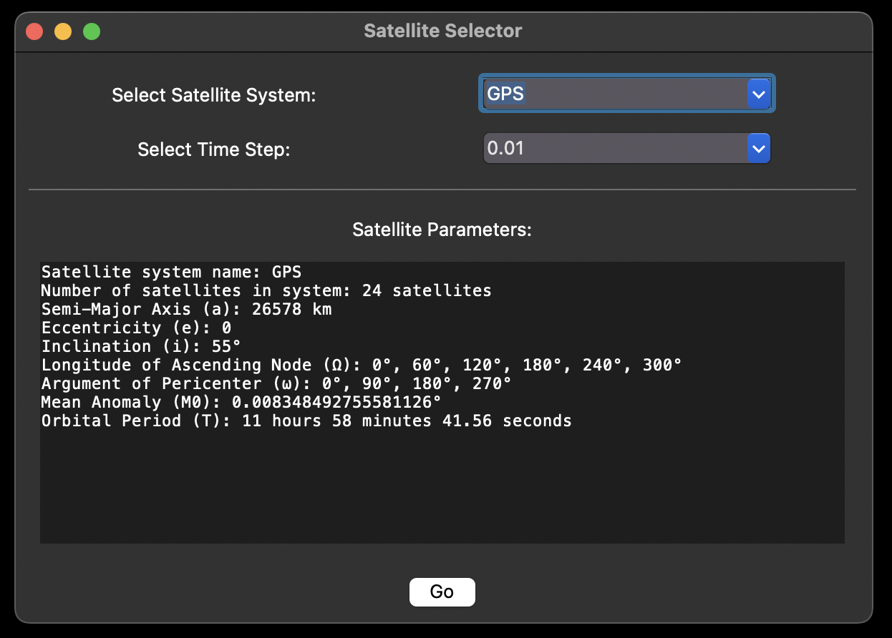
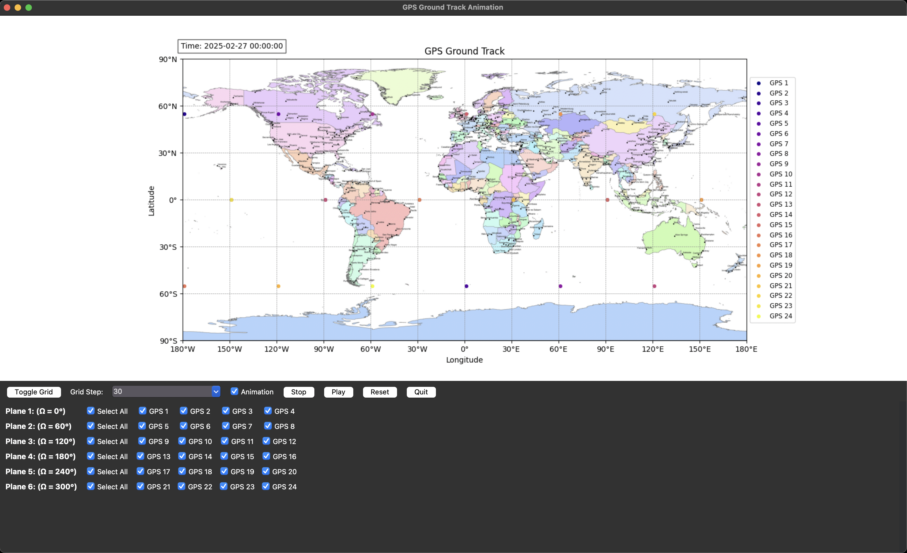

# Satellite Ground Track
Laboratory Asssignment for Satelite Ground Track
Это приложение отображает на карте Земли трассы (ground tracks) выбранных спутниковых систем. Ниже описаны способ запуска программы и основные элементы интерфейса и их назначение. Также пример работы программы.

# Как запустить программу?
1. Установить Python 3.12.9

2. Установить необходимые библиотеки, запуская следующие команды
    ```bash
    pip install -r requirements.txt
    ```

3. Запустить программу с следующие команды
    ```bash
    python main.py
    ```
    или
    ```bash
    python3 main.py
    ```

# Как работает программа?
1. Выбрирайте спутниковую систему.

2. Нажмите кнопка `Go`.

## Описание элементов интерфейса

1. **Toggle Grid**  
   Кнопка, переключающая видимость координатной сетки на карте.  
   - Нажатие на кнопку скрывает сетку, повторное нажатие возвращает её обратно.

2. **Grid Step**  
   Выпадающий список для выбора шага сетки (в градусах).  
   - Определяет, через сколько градусов будут проводиться линии широты и долготы (например, каждые 15°, 30°, 45° и т. д.).

3. **Animation**  
   Флажок (Checkbutton), управляющий режимом анимации.  
   - Если флажок установлен, при нажатии **Play** начинается покадровая анимация движения спутников.  
   - Если флажок снят, отображается статичное положение спутников (их полная траектория или её часть).

4. **Stop**  
   Останавливает анимацию, если она была запущена.

5. **Play**  
   Запускает анимацию спутников по их орбитам.  
   - Если анимация уже идёт, повторное нажатие не изменяет состояние.

6. **Reset**  
   Сбрасывает анимацию к начальному кадру.  
   - Все спутники возвращаются на исходные координаты (начало траектории), а время устанавливается на начальное.

7. **Quit**  
   Закрывает текущее окно приложения.  
   - Все элементы интерфейса и графики, связанные с этим окном, будут закрыты.

8. **Select All**  
   Флажок, позволяющий быстро выбрать или снять выбор со всех спутников в соответствующей плоскости (Plane).  
   - Удобно использовать, когда нужно одновременно включить/отключить группу спутников.

9. **Спутник (например: GPS 1, GPS 2, GPS 3 и т. д.)**  
   Индивидуальные флажки для каждого спутника.  
   - Управляют отображением спутника на карте (при включённом режиме анимации или статичном отображении).

## Дополнительно

- При активном режиме анимации (**Animation** установлен) и нажатой кнопке **Play**, спутники перемещаются по орбите, а в верхней части окна отображается текущая дата и время, соответствующие каждому кадру.
- При выключенном режиме анимации (**Animation** снят) можно видеть полную траекторию выбранных спутников или её часть (в зависимости от реализации).

# Пример работы программы
Выборка спутниковой системы


Трассировка


Видео
<video width="640" height="480" controls>
  <source src="Resources/Example.mp4" type="video/mp4">
</video>


Смотреть полное видео

<a href="https://youtu.be/H_w9uXml-cs" target="_blank">
  
</a>